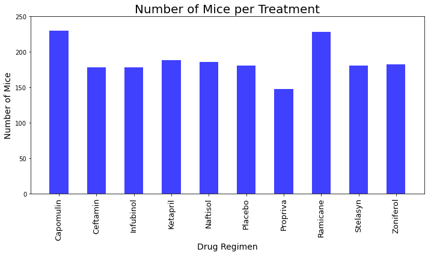
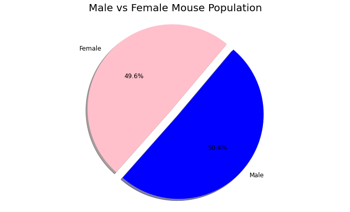
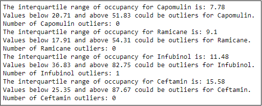
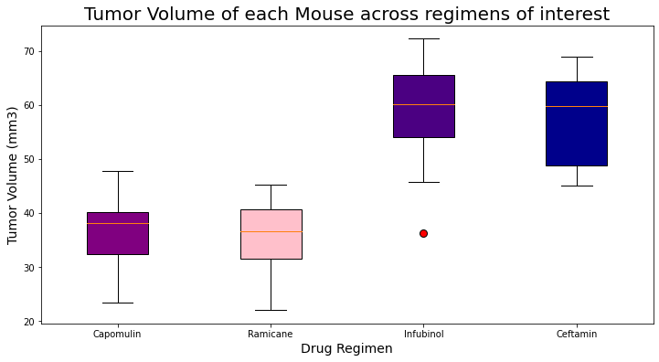
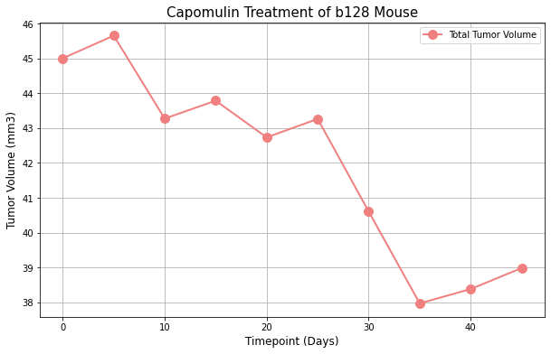
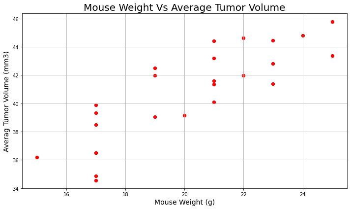
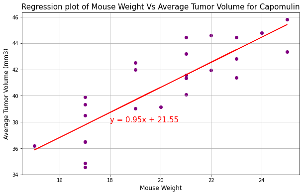

# Matplotlib-Challenge
**Submitted By:** Saloni Gupta\
_Date_: october, 30th, 2020\
Matplotlib Homework - **Pymaceuticals**  

## Background  
This respository apply a Python Matplotlib to visualize a real-world pharmaceutical data. The data is sourced from Pymaceuticals Inc., a burgeoning pharmaceutical company based out of San Diego. Pymaceuticals specializes in anti-cancer pharmaceuticals. In its most recent efforts, it began screening for potential treatments for squamous cell carcinoma (SCC), a commonly occurring form of skin cancer.

These analysis used a complete data from their most recent animal study in two datasets in CSV format. Data set one is Mouse_metadata.csv wich includes 249 mice identified data with SCC tumor growth were treated through a variety of drug regimens, and their Sex, Age_months and Weight (g) identified. The other dataset is Study_results.csv file which includes the results of the study in each columns Mouse I,Timepoint,Tumor Volume (mm3), and Metastatic Sites.

## Purpose  
The purpose of this study was to compare the performance of Pymaceuticals' drug of interest, Capomulin, versus the other treatment regimens. The analysis also generated all of the table and figures needed for the technical, and top-level summary report of the study. For this analysis both datasets imported, merged,cleaned and the aggregate data diplayed in to Python Pandas dataframes, visualized in Matplotlib, and other libraries used in order to make a stastical analysis. The project is conducted in Jupyter notebook to showcase, and communicate the analysis report.

## Observable Trends  
1. Total unique mice in the experiment were 249 and by removing duplicates the total number of mice left were 248. The total count of mice by gender showed that there were 123 female and 125 male mice which was fairly close.  
2. The bar graph showed the Drug Regimen Capomulin has the maximum mice number(230), and Zoniferol has the smaller mice number (182).  
3. From the selected treatments Capomulin and Ramicane reduces the size of tumors better.  
4. The correlation between mouse weight, and average tumor volume is 0.84. It is a strong positive correlation, when the mouse weight increases the average tumor volume also increases.  
5. The regression analysis helped us to understand how much the average tumor volume (dependent variable) will change when weight of mice change(independent variables). The R-squared(of 0.84)value is 0.70, which means 70% the model fits the data.Concluding, the model explains high variability of the response data around its mean.

## Table of Contents  
Data cleaning  
summary statistics  
Bar and Pie Charts  
Quartiles, Outliers and Boxplots  
Line and Scatter Plots  
Correlation and Regression  

## Solutions  
## Data Cleaning
- The data was loaded, read, combined, duplicate removed, and the head (5 rows on the top) of cleaned data out put looks as follows:  

## Summary statistics  
- A summary statistics table was generated by using two techniques one is by creating multiple series, and putting them all together at the end, and the other method produces everything in a single groupby function. The summary statistic table consis the mean, median, variance, standard deviation, and SEM of the tumor volume for each drug regimen. 
  - The summary stastics tables looks as follows:  

## Bar and Pie Charts
- Two identical bar charts was generated by using both Pandas's DataFrame.plot() and Matplotlib's pyplot that shows the number of total mice for each treatment regimen throughout the course of the study.

  - The Bar Charts looks as follows:  

   - Bar Chart on the Number of Mice per Treatment (Pandas's DataFrame.plot())  

   - Bar Chart on the Number of Mice per Treatment (Matplotlib's pyplot)  

- Two identical pie plot was generated by using both Pandas's DataFrame.plot() and Matplotlib's pyplot that shows the distribution of female or male mice in the study. 
  - Pi Chart on the distribution of female or male mice in the study (Pandas's DataFrame.plot())  

  - Pi Chart on the distribution of female or male mice in the study (Matplotlib's pyplot)  

## Quartiles, Outliers and Boxplots
- The final tumor volume of each mouse across four of the most promising treatment regimens was created: Capomulin, Ramicane, Infubinol, and Ceftamin. Afterward the quartiles, IQR, and potential outliers across all the four treatment regimens was quantitatively determined.

  - Capomulin Final Tumor Volume  

## Box and Whisker Plot
- A box and whisker plot of the final tumor volume for all four treatment regimens was generated, and a potential outliers highlighted by using color, and style.  
  - A box and whisker plot looks as follows:  

## Line Plots
- A line plot created on selected mouse (b128) that was treated with Capomulin, and generate a line plot of time point versus tumor volume for that mouse.  

  - A line plot looks as follows:  

## Scatter Plot
- A scatter plot of mouse weight versus average tumor volume for the Capomulin treatment regimen was created.  

  - A scatter plot looks as follows:  

## Correlation and Regression
- A correlation coefficient, and linear regression analysis was conducted between mouse weight and average tumor volume for the Capomulin treatment. A Plot of the linear regression model created on top of the previous scatter plot.

## Correlation
The correlation between mouse weight and average tumor volume is 0.84

## Regression
- Adding a linear regression line to the scatter plot  
  - A linear regression plot looks as follows:  

